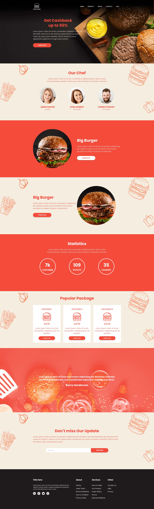
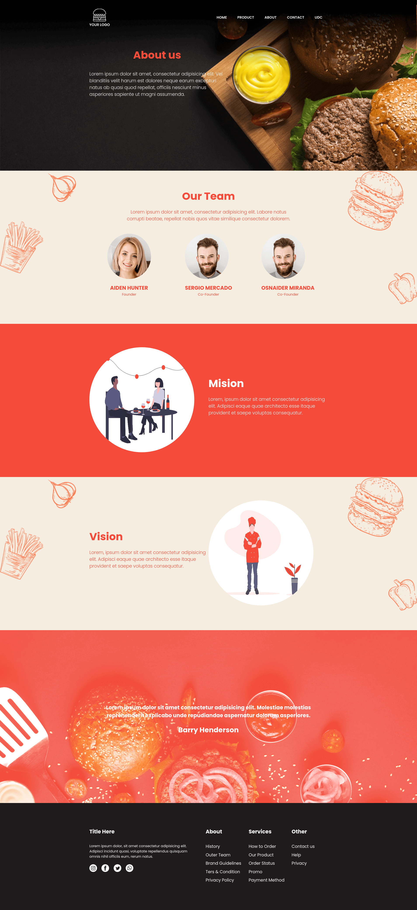
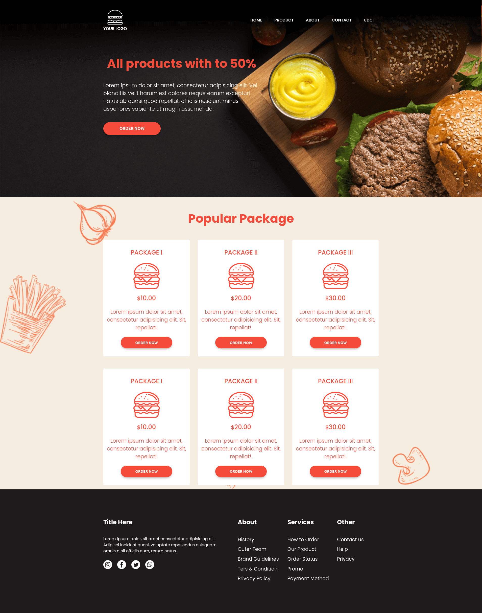
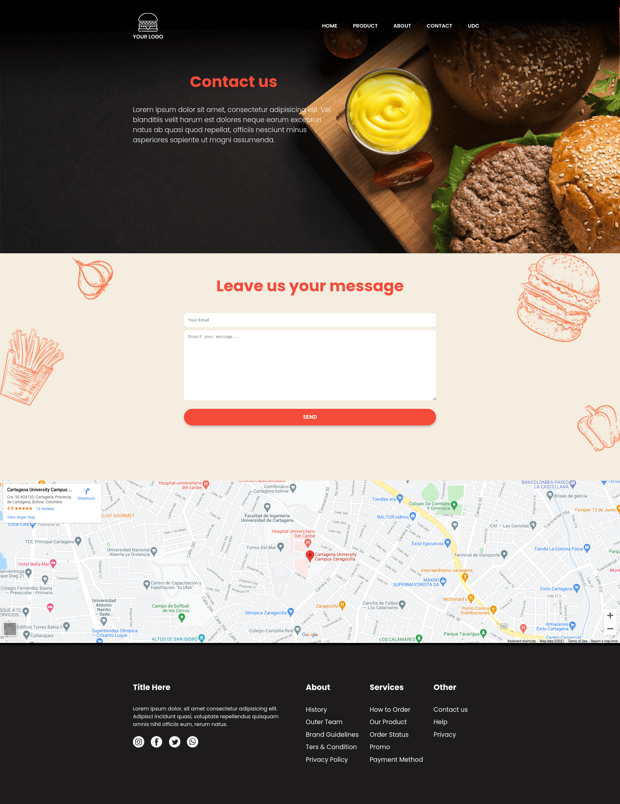

 

# Proyecto de Diseño Web

### Home preview

### About preview

### Products preview

### Contact preview

## Requerimientos

La primera es la página principal de una empresa cualquiera. Esta página posee un menú que tiene 4 ítems, cada ítem es un gráfico que al presionar lleva a las otras páginas web, de la siguiente manera:

- 1 ítem para llevar a una página informativa de productos.
- 1 ítem para llevar a una página informativa de "quienes somos?"
- 1 formulario de contacto
- Un ítem para llevar a la página de la Universidad de Cartagena.

## Integrantes:

- ###### Sergio Mercado Gutierrez (Cod: 6901620041) [Github](https://github.com/smercadog14)
- ###### Osnaider Miranda Caceres (Cod: 6901620025) [Github](https://github.com/oscles)
